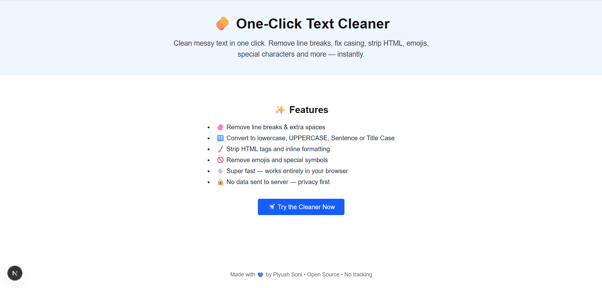
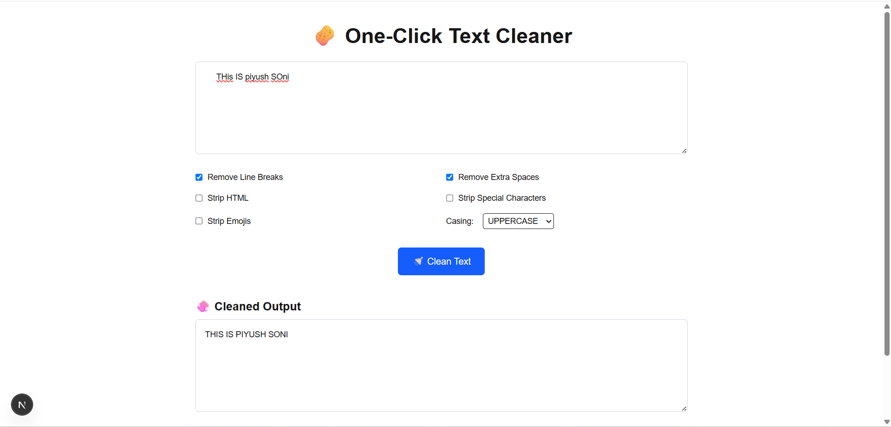

## 🧽 One-Click Text Cleaner

A simple, clean, and fast web tool built with **Next.js**, designed to help users clean and format messy text in one click.

---

## 🖼️ Screenshots

### ✨ One-Click Cleaner Interface



---

### 🔄 Before & After Example



---

### 🚀 Features

* ✅ Remove line breaks and extra spaces
* ✅ Strip HTML tags, emojis, and special characters
* ✅ Convert text casing: Sentence, Title, Lowercase, Uppercase
* ✅ Real-time preview of cleaned output
* ✅ Clean UI with responsive design

---

### 🛠️ Tech Stack

* **Framework:** Next.js 13+ (App Router)
* **Styling:** Tailwind CSS
* **Language:** TypeScript
* **Monorepo:** pnpm workspace
* **Structure:**

  * `apps/web`: Main web application
  * `packages/utils`: Shared utility package (text cleaner logic)

---

### 📁 Folder Overview

```
one-click-text-cleaner/
├── apps/
│   └── web/
│       ├── src/app/
│       │   ├── components/       # Reusable UI components
│       │   ├── text-cleaner/     # Page & logic for cleaner UI
│       │   ├── layout.tsx        # App layout
│       │   └── page.tsx          # Landing page
│       ├── public/               # Static assets
│       ├── globals.css           # Global styles
│       └── favicon.ico
├── packages/
│   └── utils/
│       └── cleaner.ts            # Text cleaning logic (shared)
├── pnpm-workspace.yaml           # Workspace config
├── package.json                  # Root dependencies
├── tsconfig.json                 # TypeScript settings
```

---

### 🧑‍💻 Local Development

#### 1. Clone the Repo

```bash
git clone https://github.com/your-username/one-click-text-cleaner.git
cd one-click-text-cleaner
```

#### 2. Install Dependencies

```bash
pnpm install
```

#### 3. Run the App

```bash
pnpm dev
```

Then open [http://localhost:3000](http://localhost:3000)

---

### 🧠 Utilities

Text cleaning logic is located in `packages/utils/cleaner.ts` and supports various formatting options via a single `cleanText()` function. This makes it easy to use the core logic in other apps or tools.

---

### 📦 Build for Production

```bash
pnpm build --filter web
```

---

### 📌 To enhance this further

* [ ] Add dark mode toggle
* [ ] Support download/export of cleaned text
* [ ] Add mobile enhancements

---

### 📃 License

MIT — free to use and modify.
